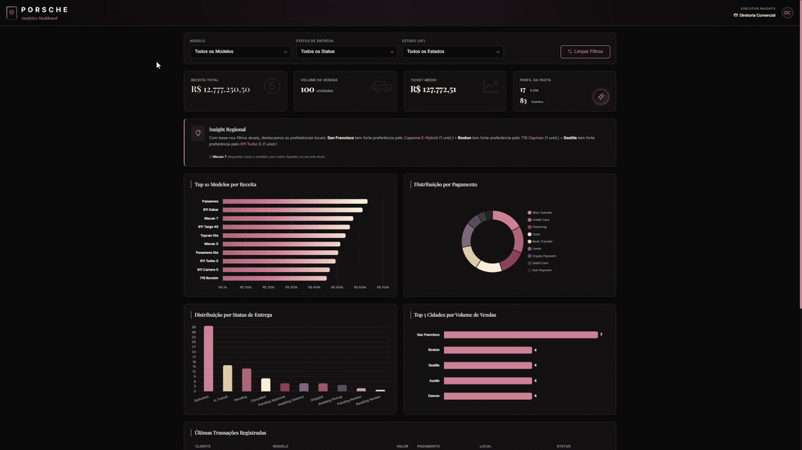

# 🚗 Dashboard de Vendas Porsche — Agentes de IA

Dashboard interativo desenvolvido a partir de uma base de vendas de veículos Porsche, utilizando **Inteligência Artificial como apoio à análise de dados, geração de insights e construção das visualizações**.

O projeto explora o uso de IA desde a análise inicial da base até a geração, avaliação e refinamento do dashboard.

---

<p align="center">
  
</p>

---

## 🎯 Objetivo do Projeto

Transformar uma base de vendas de veículos em um dashboard interativo capaz de apresentar indicadores, análises e insights sobre o desempenho comercial.

---

## 📊 Perguntas de Negócio

As perguntas foram definidas a partir da **análise exploratória inicial da base, realizada com auxílio de IA**, buscando explorar diferentes dimensões da operação comercial:

| Pergunta                                                               | Dimensão                   |
| ---------------------------------------------------------------------- | -------------------------- |
| 💰 Qual é o volume total de vendas e a receita gerada?                 | Desempenho comercial       |
| 🚘 Quais modelos apresentam maior receita?                             | Produtos                   |
| 📈 Qual é o ticket médio das vendas?                                   | Desempenho financeiro      |
| 💳 Quais formas de pagamento são mais utilizadas?                      | Comportamento de pagamento |
| 📦 Qual é a distribuição dos pedidos por status de entrega?            | Operação logística         |
| 📍 Quais cidades concentram o maior volume de vendas?                  | Distribuição geográfica    |
| 🚘📍 Quais modelos se destacam nas cidades com maior volume de vendas? | Produto × localização      |

Essas perguntas foram escolhidas para analisar **desempenho financeiro, produtos, formas de pagamento, operação logística e distribuição geográfica das vendas**.

---

## 🤖 Uso de Inteligência Artificial

### 🔎 Análise da base

O primeiro prompt utilizado foi:

```text
Quero que se comporte como analista de dados com muitos anos de experiência.
Estou enviando a base de vendas de veículos da Porsche e quero que gere
indicadores, análises e insights a partir dessa base.
Inclua a maior quantidade de insights possíveis.
```

A análise inicial serviu como base para definir os indicadores, gráficos e perguntas de negócio.

### 🖥️ Geração do dashboard

Em seguida, foi utilizado o seguinte prompt:

```text
Quero que crie um dashboard interativo para analisar a base.
Esse dashboard precisa ter todos os indicadores, gráficos e tabelas
que você levantou acima.

Não esqueça de adicionar filtros que vão mudar os valores dos gráficos
e indicadores ao serem alterados.

Crie esse dashboard em HTML/CSS/JS.
```

Para o direcionamento visual, foi solicitado um design sofisticado, inspirado na identidade visual da **Porsche Brasil**, com um toque feminino e sem elementos infantis.

### 🔄 Refinamentos

Após a geração inicial, o dashboard foi avaliado e refinado iterativamente. Entre os principais ajustes realizados:

* Padronização dos valores monetários para o formato `1.000,00`;
* Ajustes de cores e visualizações;
* Inclusão de insights sobre modelos mais vendidos por cidade;
* Reformulação dos gráficos relacionados a status de entrega e distribuição regional;
* Criação do gráfico **Top 5 Cidades por Volume de Vendas**, com barras horizontais, ordenação decrescente, cor rose gold, número de vendas e tooltip com cidade, vendas e modelo líder;
* Inclusão de cabeçalho para identificação da empresa.

Na revisão final, foi identificado que o título **“Funil Logístico (Status de Entrega)”** não correspondia adequadamente à visualização apresentada. Nesse caso, em vez de solicitar uma nova alteração à IA, o arquivo HTML foi editado manualmente para corrigir o título.

Esse processo evidencia a utilização da **revisão humana sobre o resultado gerado pela IA**.

---

## 🧹 Tratamento da Base

Antes de enviar a base para a IA:

* Foram mantidas apenas as colunas sanitizadas;
* Os títulos das colunas foram traduzidos.

---

## 🧰 Ferramentas Utilizadas

| Ferramenta          | Utilização                                  |
| ------------------- | ------------------------------------------- |
| 🤖 **Gemini Pro**   | Análise da base e geração do dashboard      |
| 🖥️ **Canvas**      | Desenvolvimento do dashboard com IA         |
| 💬 **ChatGPT**      | Desenvolvimento e avaliação do projeto      |
| 🌐 **HTML**         | Estrutura do dashboard                      |
| 🎨 **CSS**          | Estilização e identidade visual             |
| ⚙️ **JavaScript**   | Interatividade e funcionamento dos gráficos |
| 🐙 **GitHub Pages** | Publicação do dashboard                     |

> **Observação:** O ChatGPT foi utilizado durante o desenvolvimento e avaliação do projeto. A geração do dashboard foi realizada com o **Gemini Pro com Canvas**. Não foi utilizado um agente com skill para a geração do dashboard.

---

## 🌐 Dashboard Publicado

🔗 [**Acessar o Dashboard Porsche**](https://vanmatos.github.io/Dashboard-Porsche-Agentes-IA/)

---

## 📌 Considerações

Este projeto demonstra uma abordagem de desenvolvimento **assistida por Inteligência Artificial**, utilizando IA para apoiar a exploração dos dados, identificação de indicadores, geração de insights e construção do dashboard.

A solução também evidencia a importância da **avaliação e revisão humana**, tanto na análise das visualizações quanto na identificação e correção de inconsistências no resultado gerado.

---

### 👩‍💻 Projeto desenvolvido por vanmatos

**Dashboard de Vendas Porsche | Agentes de IA | BI & Data Analytics**
